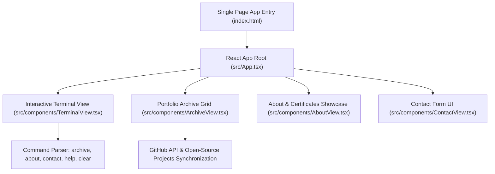

# 🎨 ZYEKH ABDUL — Terminal & Security Portfolio (`zyekh.cloud`)

<p align="center">
  <a href="https://github.com/zyekhabdul/zyekh.cloud/actions/workflows/ci.yml">
    
  </a>
  <a href="LICENSE">
    
  </a>
  <a href="https://react.dev/">
    
  </a>
  <a href="https://www.typescriptlang.org/">
    
  </a>
  <a href="https://vitejs.dev/">
    
  </a>
  <a href="https://tailwindcss.com/">
    
  </a>
</p>

A terminal-themed, interactive single-page portfolio application focused on Digital Forensics & Incident Response (DFIR), Linux Kernel Security, and Full-Stack Web Development. Built with **React 19**, **Vite 6**, **TypeScript 5**, and **Tailwind CSS**.

---

## 🏗️ Architecture & Component Overview



---

## 🚀 Key Features

- 🖥️ **Interactive Cyber Terminal**: Custom command-line interface supporting shell-like navigation (`archive`, `about`, `contact`, `help`, `clear`, `cat`).
- 📁 **Repository Archive Showcase**: Grid view displaying top open-source projects, badges, tech tags, and direct GitHub links.
- 🎨 **Modern Dark Mode Aesthetic**: Sleek, high-contrast dark theme with glassmorphism and subtle glowing micro-animations.
- ⚡ **Lightning Fast Vite Build**: Zero-delay HMR and optimized static production bundle.

---

## 💻 Development & Quick Start

```bash
# Clone repository
git clone https://github.com/zyekhabdul/zyekh.cloud.git
cd zyekh.cloud

# Install dependencies
npm install

# Start local development server
npm run dev

# Build production distribution (dist/)
npm run build

# Preview production build locally
npm run preview
```

---

## 📜 License

MIT License © 2026 Zyekh Abdul Qadir Jailani. Designed for Security Engineers & Developers.
